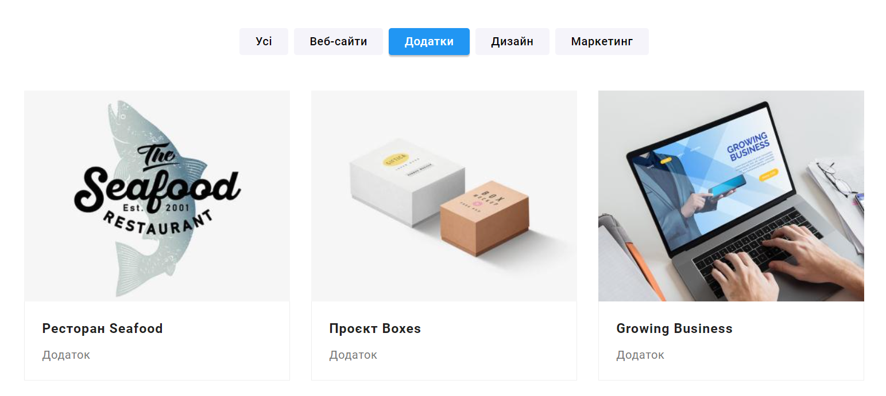

# WebStudio

This is the README file for the WebStudio portfolio website. This website is designed to showcase the works, skills, and services offered by WebStudio.

## Links

- **Website:** [https://www.webstudio-portfolio.com](https://acvetochka.github.io/WebStudio/)

## Description

Our web studio specializes in the development of websites, web applications, and graphic design. We work with various clients, including businesses, startups, and individuals. Our goal is to provide high-quality internet solutions that meet the needs of our clients.

- **Portfolio**: On our site, you will find our best works and projects. We provide a brief description of each project and include images for visual representation.

- **Services**: We provide information about the services we offer, including web development, design, and other services related to our specialization.

- **Contact**: We offer convenient contact methods for potential clients. You can reach us through a feedback form, phone, email, or social media.
  

- **About Us**: You will find information about our web studio, our team, and our mission.

## Website Functionality

- **Responsive Design** - The website is fully responsive and optimized for display on various devices, including computers, tablets, and smartphones.

  
Tablet:

  
Mobile:

- **Filtering** - Filtering by types of applications is implemented on the "Portfolio" page.

## Technologies Used

  
  
  
  

**Utilities**:

   
   
   

## About the Author
This website was created by Aliona Kuznetsova.
[Github](https://github.com/acvetochka)
[LinkedIn](https://www.linkedin.com/in/alona-kuznietsova/)
