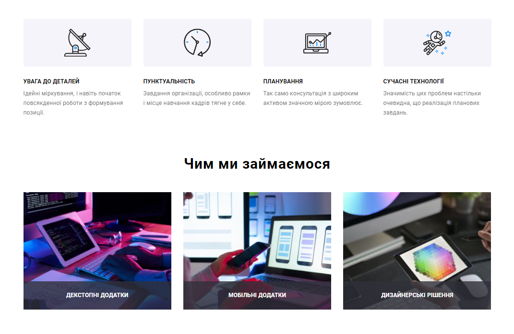
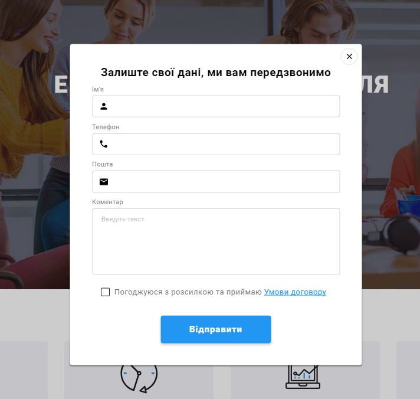
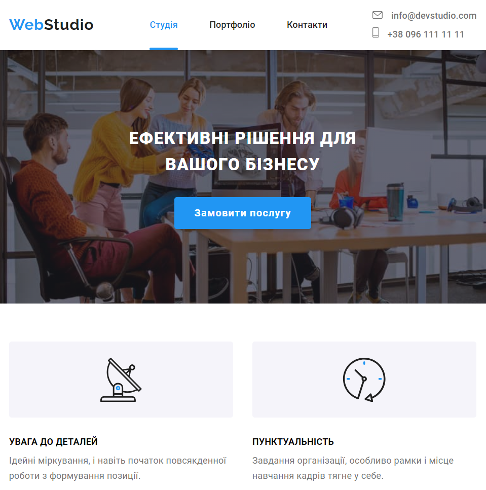

# WebStudio

Це README файл для веб-сайту-портфоліо WebStudio. Цей веб-сайт призначений для демонстрації робіт, навичок і послуг, що надаються WebStudio.

## Посилання

- **Сайт:** [https://www.webstudio-portfolio.com](https://acvetochka.github.io/WebStudio/)

## Опис

Наша веб-студія спеціалізується на розробці веб-сайтів, веб-додатків і графічного дизайну. Ми працюємо з різними клієнтами, включаючи підприємства, стартапи та фізичних осіб. Наша мета - надавати високоякісні інтернет-рішення, які задовольняють потреби наших клієнтів.

- **Портфоліо**: На нашому сайті ви знайдете наші найкращі роботи і проекти. Ми пишемо короткий опис кожного проекту і надаємо зображення для візуального представлення.

- **Послуги**: Ми надаємо інформацію про послуги, які ми пропонуємо. Це включає веб-розробку, дизайн і інші послуги, що стосуються нашої спеціалізації.

- **Контакти**: Ми пропонуємо зручний спосіб зв'язку для потенційних клієнтів. Ви можете зв'язатися з нами через форму зворотнього зв'язку, за телефоном, за допомогою електронної пошти, або через соціальні мережі.

- **Про нас**: Ви знайдете інформацію про нашу веб-студію, нашу команду і нашу місію.

## Функціональність сайту

- **Адаптивна верстка** - Веб-сайт повністю адаптивний та оптимізований для відображення на різних пристроях, включаючи комп'ютери, планшети та смартфони.

<!--  -->

  
Tablet:

  
Mobile: 

<!--  -->

- **Фільтрація** - на сторінці "Портфоліо" реалізована фільтрація за типами додатків.

## Використані технології

  
  
  
  

 **Utilites**:

   
   
   

## Про автора
Цей веб-сайт був створений Альоною Кузнєцовою
[Github](https://github.com/acvetochka)
[LinkedIn](https://www.linkedin.com/in/alona-kuznietsova/)
